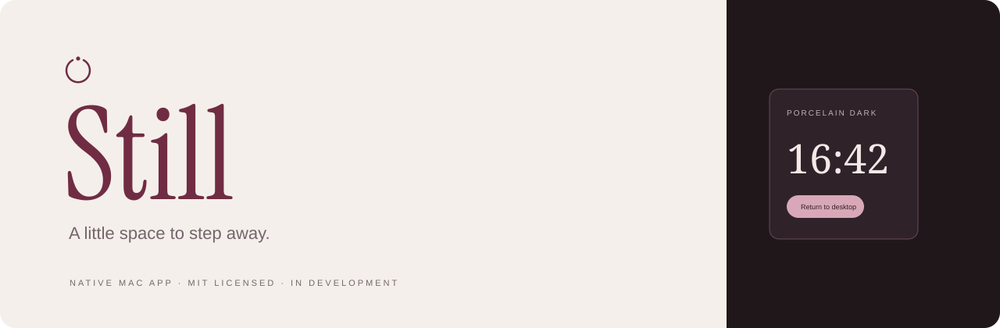

<p align="center">
  
</p>

# Still

A calm screen for your Mac, with optional inactivity activation.

**In development · Native macOS · Direct distribution · Next.js website**

[Meet Still](https://meet-still.app) · [Development field notes](https://meet-still.app/changelog)

Still creates a visual privacy curtain over the desktop. It does not replace the macOS security lock or guarantee that every third-party task continues processing. Porcelain is the initial design standard, with warm light/dark appearances and a burgundy identity. Optional native Codex and Claude quota widgets are available in the local development app. A local declarative plugin SDK/importer and optional advisory agent activity hooks are implemented; additional themes and a marketplace remain future scope.

## Try the native preview

```sh
./scripts/build-macos.sh
open out/Still.app
```

Manual curtain, Porcelain light/dark/system, a contextual menu and embedded Touch ID with system-password fallback are implemented. This is an ad-hoc signed development app; the authentication and desktop-mode acceptance checks remain open. See the [user guide](docs/guides/native-preview.md), [Phase 1 evidence](docs/verification/phase-01-native-curtain.md) and [interaction refinement](docs/verification/phase-01-interaction-refinement.md). The currently prepared candidate is `out/Still-preview.app`; quit the old running app before opening it.

The candidate includes optional inactivity activation, disabled initially. The Mac stays awake automatically while the curtain is active; the display stays on until return or suspension. Independent timed awake/display controls remain hidden, with their implementation retained. macOS 26 uses native Liquid Glass controls with a solid privacy curtain and accessibility fallbacks. Read the [inactivity guide](docs/guides/idle-and-energy.md) and [latest refinement](docs/verification/phase-02-deferred-awake-and-spaces.md). Mission Control and trackpad desktop transitions remain known coverage limitations.

## Explore the design

```sh
pnpm dev
```

Open [Porcelain Light](http://127.0.0.1:3000/preview?theme=porcelain&view=screen&appearance=light) or [Porcelain Dark](http://127.0.0.1:3000/preview?theme=porcelain&view=screen&appearance=dark). Switch appearance, inspect settings and preview the website. Other theme directions remain available for future collections.

This is a disposable browser prototype. Authentication, activity and energy are simulated. It never locks the Mac, changes power settings, or reads agent conversations. The preview and production landing share the existing Next.js app; no Python server is required. Preview routes are local, noindex and unavailable on production.

## Product and architecture

| Area | Direction | Current state |
| --- | --- | --- |
| Mac app | SwiftUI + AppKit, OS-owned authentication, scoped power controls | Local `.app` built; structural checks pass; native interaction acceptance pending |
| Appearance | Porcelain, burgundy, light/dark/system | Interactive design preview with local licensed fonts |
| Website | Next.js App Router, typed content/SEO, local fonts | Live on [meet-still.app](https://meet-still.app); GitHub-connected Vercel builds |
| Distribution | Signed/notarized app download; evaluate Homebrew cask | No release, hosted package or usable install command |
| Plugins and agents | Native Hub, Codex and Claude quota widgets | Real quota exercised; local SDK/import built; advisory hook delivery acceptance pending; no approval actions |

## Workspace map

- [Development status](docs/development/README.md) · [developer practices](docs/development/practices.md)
- [Roadmap](docs/roadmap.md) · [Product strategy](docs/product-strategy.md) · [decisions](docs/decisions.md) · [architecture](docs/architecture.md)
- [Brand fundamentals](docs/brand-fundamentals.md) · [design contract](DESIGN.md) · [canonical tokens](design/tokens.json)
- [Native feasibility](docs/research/macos-feasibility.md) · [direct distribution](docs/distribution.md)
- [Next.js website plan](docs/website-plan.md) · [launch strategy](docs/launch-strategy.md)
- [Website/hosting guide](docs/guides/website-and-hosting.md) · [delivery evidence](docs/verification/phase-04-website-and-hosting.md)
- [Widgets and plugins](docs/plugins-and-widgets.md) · [Plugin developer guide](docs/guides/plugin-development.md) · [Agent awareness](docs/agent-awareness.md) · [prototype notes](prototypes/NOTES.md)

## Verify the workspace

```sh
pnpm check
pnpm build
pnpm typecheck
pnpm check:brand
```

Palette roles are checked from the source tokens. Bundled font files include licenses and [provenance hashes](design/fonts/manifest.json). No system-wide font installation or font CDN is needed.

## Project status

Source is private under [mateonunez/still](https://github.com/mateonunez/still). The public Next.js site is hosted by the personal [Vercel project](https://vercel.com/mmateonunez/still). Native acceptance, Developer ID signing, pricing and public app release remain separate steps. There is no App Store release planned.

Development requires Node 24/pnpm and Xcode/Swift for native builds. Verification tools use Node; Python is not required. See the [preview guide](docs/guides/design-preview.md).
